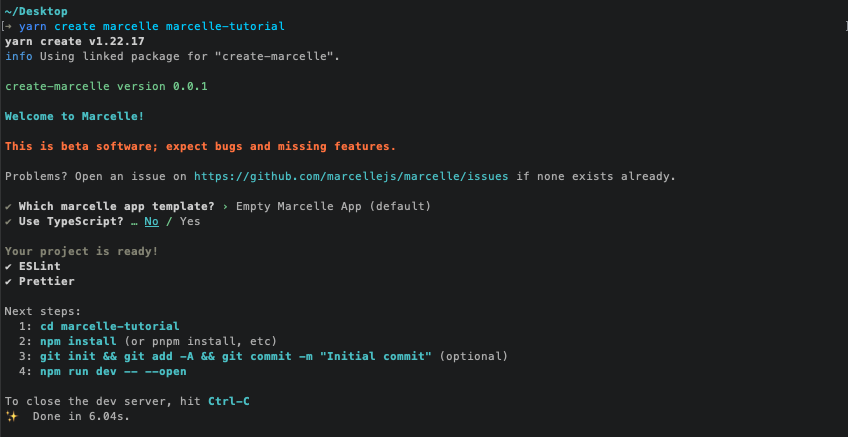

# CLI

Marcelle provides an application generator ([`create-marcelle`](https://github.com/marcellejs/marcelle/tree/master/packages/create-marcelle)) as well as a command line interface ([`@marcellejs/devtools`](https://github.com/marcellejs/marcelle/tree/master/packages/devtools)) for generating components and managing backends in Marcelle projects.

## Generating Marcelle Applications

To create a new Marcelle project, just run:

<CodeGroup>
<CodeGroupItem title="npm">

```bash
npm init marcelle marcelle-tutorial
cd marcelle-tutorial
npm install
```

</CodeGroupItem>

<CodeGroupItem title="yarn">

```bash
yarn create marcelle marcelle-tutorial
cd marcelle-tutorial
yarn
```

</CodeGroupItem>

<CodeGroupItem title="pnpm">

```bash
pnpm create marcelle marcelle-tutorial
cd marcelle-tutorial
pnpm i
```

</CodeGroupItem>
</CodeGroup>

Several options are available:

- Templates:
  - **Empty Marcelle App (default)**: a minimalistic Vite application, perfect for prototyping dashboards
  - **SvelteKit+Marcelle App**: a more elaborate template for multipage applications with a custom interface. It uses [SvelteKit](https://kit.svelte.dev/).
- TypeScript: use [Typescript](https://www.typescriptlang.org/) for your Marcelle application (including for custom components)



## Development Tools (CLI)

When generating a new Marcelle application, a CLI is installed as a development dependency (`@marcellejs/devtools`). It includes a number of useful tools for development.

To run the CLI from your project's root:

<CodeGroup>
<CodeGroupItem title="npm">

```bash
npx marcelle
```

</CodeGroupItem>

<CodeGroupItem title="yarn">

```bash
yarn marcelle
```

</CodeGroupItem>

<CodeGroupItem title="pnpm">

```bash
pnpx marcelle
```

</CodeGroupItem>
</CodeGroup>

### Generating a Component

It is possible to use the CLI to create new custom components for an application or a marcelle package. Run `npx marcelle`, then select 'Create a component' and enter your component's name (e.g. `my-component`). The generator will create a template component that you can use your in your script:

```js
import { myComponent } from './components';

const m = myComponent(opts);
```

Components are stored in the `src/components` directory and provide a [Svelte](https://svelte.dev) view by default:

```bash
.
├── src
│   └── components
│       ├── my-component
│       │   ├── my-component.component.js # Component definition file
│       │   ├── my-component.view.svelte    # Svelte component defining the component's view
│       │   └── index.js            # function wrapper
│       └── index.js
```

### Managing the Backend

The CLI offers two tools to manage persistent data in a server-side 'backend'.

#### Configuring a backend

To simply add a backend to your application, select 'Manage the backend', then 'Configure a backend'. this will install `@marcellejs/backend` as a dependency to your project and create configuration files.

Two options are available for the backend:

- The type of database: [NeDB](https://github.com/louischatriot/nedb) and [MongoDB](https://www.mongodb.com/) are currently supported.
- Whether or not it should use authentication.

After reinstalling dependencies (`npm install` or `yarn` or `pnpm install`), you can run the server:

```bash
npm run backend
```

The backend configuration files are stored in `backend/configuration`.

#### Exporting a backend (experimental)

It is possible to export the source code for the backend in the './backend' directory in order to customize it.
